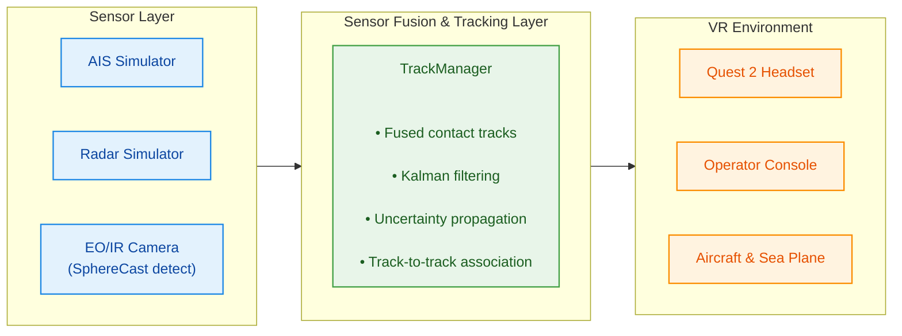

# Real Time Visualization Methods for Airborne Surveillance

## Overview:
This project implements a virtual reality (VR)-based system for airborne surveillance operators.
The system fuses data from multiple sources like the Automatic Identification System (AIS), radar and Electro-Optical/Infrared (EO/IR) camera and presents real-time augmented reality (AR) overlays with uncertainty visualization directly in the Meta Quest 2 VR environment.

## Problem Statement
Operators on board airborne surveillance missions face challenges related to:
* Information overload from multiple sensor sources
* Uncertainty in sensor data is not communicated to the operator
* Cognitive load of manually correcting sensor detections
* Limited situational awareness with traditional 2D displays

## Proposed Solution
A VR-based interface with AR overlays that accomplishes several tasks. The system fuses AIS data with radar data using Kalman filtering.
Moreover, uncertainty in those sensors is visualized using confidence indicators. The system allows the operator to take control of the
EO/IR camera to identify unknown ships. Ultimately, all the necessary information is presented to the operator through AR overlays in 3D.

## Features
- Multi-Sensor Fusion
  * AIS implementation
  * Radar contact detection and identification
  * Kalman filter-based sensor fusion
  * Real-time position estimation with uncertainty quantification
- EO/IR Camera System
  * Virtual camera mounted underneath the aircraft with gimbal control
  * Pan, tilt and zoom controls in the VR controllers
  * Visual ship confirmation workflow
  * Adaptive SphereCast detection
- VR Interface with AR Overlays
  * 3D AR overlays on top of ships in the VR scene
  * Uncertainty-aware visualizations (confidence indicators, position uncertainty)
  * Deterministic AR overlays (when all the ships transmit AIS data and position is known)
  * Real-time distance, bearing and identity information
- Meta Quest 2 Integration
  * Full 6 degrees of freedom tracking
  * Intuitive controller-based interaction
  * Operator console with interactive display
  * Camera feed display with telemetry information
 
## Tasks and Scenarios

Three scenarios were implemented in the VR interface for comparative evaluation. The scenarios with their respective tasks are:
1. Scenario 1: All ships transmit AIS data with radar and EO/IR sensors turned off and overlays being deterministic.
   - AIS data with ship identity
   - Deterministic position markers
   - Point-and-click on ships to confirm their identity
2. Scenario 2: Some ships do not transmit AIS data, radar and EO/IR sensors are turned on.
   - Some ships do not transmit AIS data (unknown contacts)
   - Radar-based detection
   - Manual confirmation with EO/IR camera is required
3. Scenario 3: AIS data from ships and radar data is fused together and overlays are uncertainty-aware.
   - AIS + radar sensor fusion
   - Confidence indicators that are color-coded based on degree of confidence
   - Position uncertainty displayed in the overlay (±XX m)
   - Manual confirmation with EO/IR camera is required

## System Architecture

## Installation
### Prerequisites
* Unity Editor 2022.3 LTS or later
* Meta Quest 2 VR headset
* Sidequest or ADB for APK installation

### Project Setup
1. Clone the repository
```
# code block
git clone https://github.com/yourusername/master-thesis.git
cd master-thesis
```
2. Open in Unity
   * Launch Unity Hub
   * Click "Add" -> select project folder
   * Open with Unity 2022.3 LTS or later version
3. Install required packages
   * Open Package Manager (Window -> Package Manager)
   * Install the packages:
     * XR Plugin Management
     * XR Interaction Toolkit (with Starter Assets)
     * Oculus XR Plugin (via XR Plugin Management)
4. Configure for Quest 2
   * File -> Build Settings -> Android
   * Switch Platform
   * Player Settings
     * Package Name: com.YourCompany.Master-thesis
     * Minimum API Level: Android 10.0 (API 29)
     * XR Plugin Management -> Oculus -> Enable
     * Graphics API: OpenGLES3
     * Stereo Rendering Mode: Multiview
    
### Building for Meta Quest 2
1. Enable Developer Mode on Quest 2
   * Create Oculus Developer account
   * Oculus app (phone) -> Devices -> Quest 2
   * Toggle Developer Mode ON
2. Build the APK from Unity
   * File -> Build Settings -> Switch to Android
   * Click on Build to save the APK or Build and Run
   to directly build to the Meta Quest 2 (requires USB connection)
3. Install the APK to the Meta Quest 2 (if using Build in Unity)
   * Option A: Move the APK into the SideQuest window
   * Option B: Use the ADB command line `adb install -r YourApp.apk`
4. Launch the application on the Meta Quest 2
   Quest 2 -> Library -> Unknown Sources -> Your App

   
   
